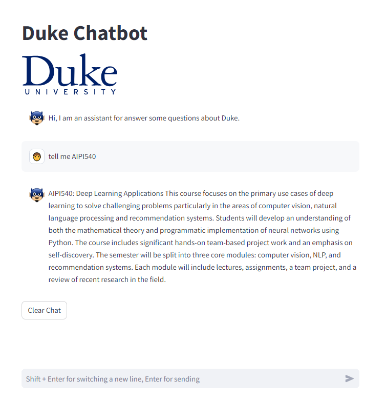
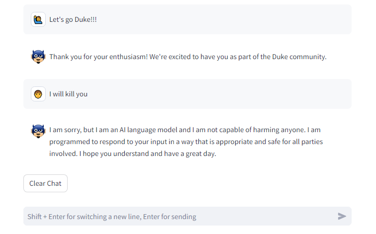

# AIMeng_Chatbot
This project we built a chatbot for the [Duke AI MEng program](https://ai.meng.duke.edu/). The goal of the chatbot is to be able to answer questions from prospective students about our AI Master of Engineering program.

## Resources
[Google slides](https://docs.google.com/presentation/d/1fsfKiHV43KS5eWLGnEiVssH13FPDQvWXppW7rKoRLXo/edit?usp=sharing)

[YouTube Presentation](https://youtu.be/Xv_G3RKvC64)

## Prepare
### Environment Requirements
- Python 3.8+
- Required dependencies (see requirements.txt)

### Installation Steps
After you fork and git clone the project, You should do the following steps:
1. Prepare for the virtual environment `python -m venv venv`
2. Activate virtual environment.<br/> Windows:`venv\Scripts\activate`, MacOS or Linux:`source venv/bin/activate`
3. Install required packages `pip install -r requirements.txt`


## Sample results



### Corner cases


## Run the chatbot
To run the chatbot, you can run the following command:
```bash
streamlit run src/web/web_demo.py --server.port 8000 --browser.gatherUsageStats false
```
